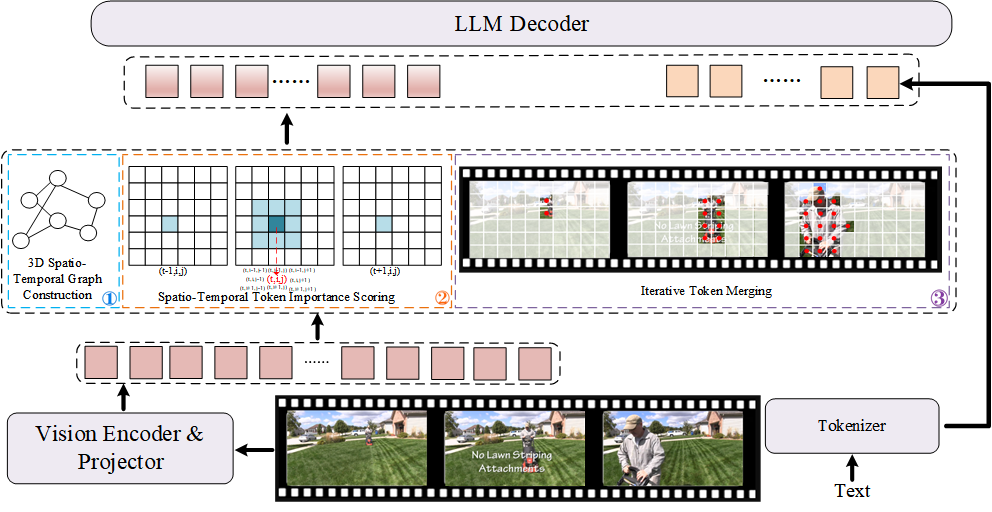

# GraTok: 3D Spatio-Temporal Graph Token Compression for Video MLLMs

Welcome to **GraTok**!

GraTok is a **training-free 3D spatio-temporal graph-based token compression method** designed for efficient video multimodal large language models (Video MLLMs). It reduces redundant visual tokens while preserving essential spatial and temporal information, enabling efficient video understanding with reduced computational cost.

## Overview

The overall pipeline of GraTok is illustrated below:

<p align="center">
  
</p>

GraTok constructs a unified spatio-temporal graph over visual tokens and performs importance-aware iterative token merging. The proposed method can be directly applied to existing Video MLLMs without additional training.

---

# Environment

GraTok is tested under the following environment:

- Python >= 3.10.0
- PyTorch
- Transformers
- lmms-eval

This project relies on **lmms-eval** for evaluation.

For the complete evaluation framework, supported models, and benchmark implementation, please refer to:

https://github.com/EvolvingLMMs-Lab/lmms-eval

If you would like to use the complete evaluation pipeline, please follow the installation instructions provided by lmms-eval.

---

# Run Evaluation

We provide evaluation scripts for different Video MLLM backbones.

## Qwen3-VL

```bash
bash examples/models/qwen3vl_compress.sh
```
## LLaVA-OneVision-1.5
First, unzip `llava.zip` into `lmms_eval/models/model_utils/compress`, and then run the evaluation.
```bash
bash examples/models/llava_ov1_5_compress.sh
```
## Customize Model and Dataset
The above scripts will automatically download the required model weights and datasets from Hugging Face.

By default, all downloaded files will be stored in `~/.cache/huggingface`. You can specify another cache directory by setting `export HF_HOME=/path/to/your/cache`.

The model checkpoint and evaluation dataset can be specified through command-line arguments. Use `--model_args` to select the desired pretrained model weights. Use `--task` to select the evaluation benchmark.

